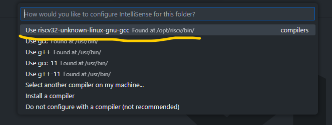
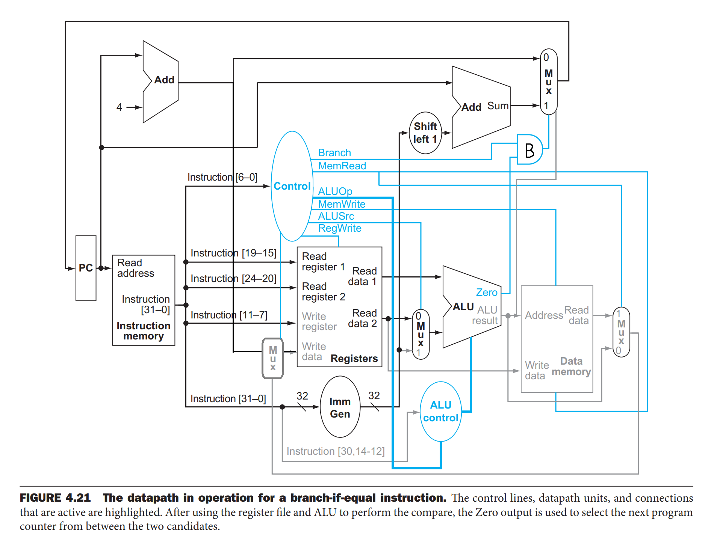
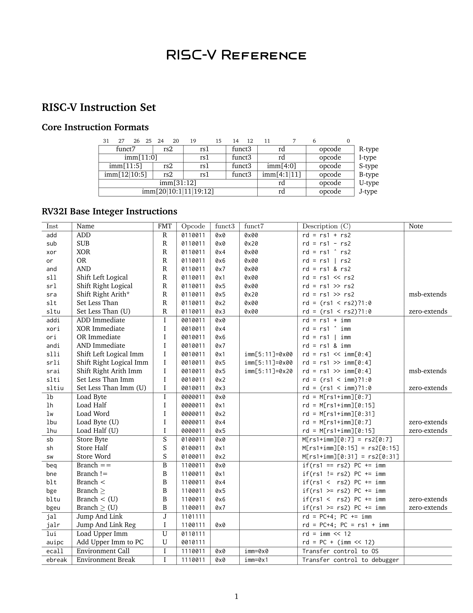
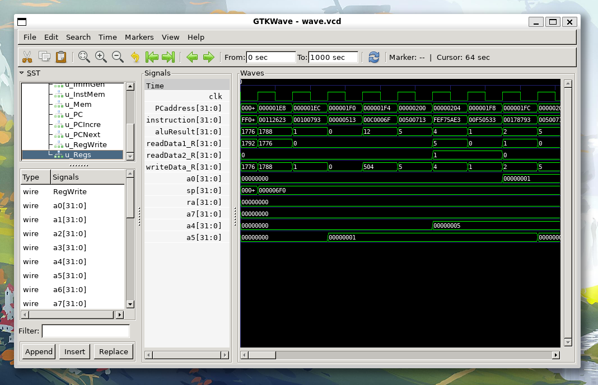

# RISC-V单周期CPU设计

Web模拟器：[RISC-V Interpreter](https://www.cs.cornell.edu/courses/cs3410/2019sp/riscv/interpreter/)    
项目源代码：[Invisiphantom/RISC-V-SIngle-Cycle](https://github.com/Invisiphantom/RISC-V-SIngle-Cycle)    
项目环境配置：[IVerilog+VSCode环境配置 | Mind City](https://invisiphantom.github.io/Skill/IVerilog+VSCode%E7%8E%AF%E5%A2%83%E9%85%8D%E7%BD%AE/)    
项目代码解析：[RISC-V单周期CPU设计 | Mind City](https://invisiphantom.github.io/Skill/RISC-V%E5%8D%95%E5%91%A8%E6%9C%9FCPU%E8%AE%BE%E8%AE%A1/)   


- 相关项目
  - Y86-64单周期CPU：[Y86-64单周期CPU设计 | Mind City](https://invisiphantom.github.io/Skill/Y86-64%E5%8D%95%E5%91%A8%E6%9C%9FCPU%E8%AE%BE%E8%AE%A1/)  
  - RISC-V流水线CPU：[Invisiphantom/RISC-V-Pipeline](https://github.com/Invisiphantom/RISC-V-Pipeline)   

------


### 安装RISCV-32工具链

由于`binutils-riscv32-linux-gnu`和`gcc-riscv32-linux-gnu`无法直接通过apt安装    
所以需要手动从Github下载工具链并添加到环境变量  
#### 从riscv-gnu-toolchain下载编译好的工具链
[Releases · riscv-gnu-toolchain](https://github.com/riscv-collab/riscv-gnu-toolchain/releases)   

#### 解压后将其移动至`/opt/riscv`文件夹
```bash
sudo mv riscv /opt/riscv
```
#### 将`/opt/riscv/bin`添加到`~/.bashrc`中的环境变量
打开`~/.bashrc`并在末尾行添加  
```bash
export PATH=/opt/riscv/bin:$PATH
```
#### 测试工具链是否安装成功
查看`riscv32-unknown-linux-gnu-gcc`的版本信息  
```bash
$ riscv32-unknown-linux-gnu-gcc --version

riscv32-unknown-linux-gnu-gcc () 13.2.0
Copyright (C) 2023 Free Software Foundation, Inc.
This is free software; see the source for copying conditions.  There is NO
warranty; not even for MERCHANTABILITY or FITNESS FOR A PARTICULAR PURPOSE.
```
新建`demo.c`文件  
```c
#include <stdio.h>

int main() {
    printf("Hello World!\n");
    return 0;
}
```
使用`riscv32-unknown-linux-gnu-gcc`进行编译  
```bash
$ riscv32-unknown-linux-gnu-gcc demo.c -o demo
```
使用`qemu-riscv32`运行生成的可执行文件  
```bash
$ qemu-riscv32 demo

Hello World!
```
#### 配置VSCode的IntelliSense和Code-Runner
打开VSCode的命令面板并选择`riscv32-unknown-linux-gnu-gcc`  
```
> C/C++: Select IntelliSense Configuration
```

修改Code-Runner的指令匹配规则  
```json
"code-runner.executorMap": {
        "c": "cd $dir && riscv32-unknown-linux-gnu-gcc -Og $fileName -o $fileNameWithoutExt && riscv32-unknown-linux-gnu-objdump -d $dir$fileNameWithoutExt > $dir$fileNameWithoutExt.S && qemu-riscv32 $dir$fileNameWithoutExt",
        "cpp": "cd $dir && riscv32-unknown-linux-gnu-g++ -Og $fileName -o $fileNameWithoutExt && riscv32-unknown-linux-gnu-objdump -d $dir$fileNameWithoutExt > $dir$fileNameWithoutExt.S && qemu-riscv32 $dir$fileNameWithoutExt",
    },
```
这样就可以通过`Ctrl+Alt+N`一键编译，反汇编和运行了   
  

### 整体架构图(《cod RISC-V Edition》 P260)


- PC: 选择PCaddress的更新方式(累加or跳转)
- InstMem: 从内存中取出PCaddress地址处的指令
- Control: 将指令进行译码
- Regs: 选择需要读取的寄存器和要写入的寄存器
- ImmGen: 对立即数进行符号扩展
- ALUControl: 选择ALU需要执行的运算
- ALU: 执行运算并更新标志位
- Mem: 执行内存的读写操作

### RISC-V RV32-I指令集([RISC-V Reference](https://www.cs.sfu.ca/~ashriram/Courses/CS295/assets/notebooks/RISCV/RISCV_CARD.pdf))


#### 译码器`Control`的输出信号
```
RegWrite 是否需要写入寄存器
ALUSrc   ALU的端口B数据是来自寄存器还是立即数
	  0-Reg 1-Imm
ALUOp    ALU的控制模式
	  00-add 01-sub 10-R-type 11-I-type
MemRead  是否需要读取内存
MemWrite 是否需要写入内存
Branch   是否需要条件跳转
Jump     是否需要直接跳转
JumpReg  是否需要寄存器跳转
Lui      是否需要加载高位立即数
Auipc    是否需要加载高位立即数加PC
```

#### 各指令类型对应的输出信号
`Uni`是该类指令的专有输出信号名称(例如`jalr`指令对应`JumpReg`信号)
```
        RegWrite ALUSrc ALUOp   Uni
R-type  1        0      10
I-type  1        1      11
Load    1        1      00      MemRead
Store   0        1      00      MemWrite


Branch  0        0      01      Branch
jal     1        x      xx      Jump
jalr    1        1      00      JumpReg
lui     1        1      00      Lui
auipc   1        1      00      Auipc
```

#### 各指令类型需要使用ALU执行的运算
```
R-type  rd      = rs1 ops rs2
I-type  rd      = rs1 ops imm
Load    memAddr = rs1 +   imm
Store   memAddr = rs1 +   imm


Branch  Flag    = rs1 -   rs2
jal
jalr    PCnext  = rs1 +   imm
lui     rd      = 0   +   imm
auipc   rd      = PC  +   imm
```

#### ALU输出的三个标志位
```
zero    两数相等
s_less  有符号小于
u_less  无符号小于
```

### Verilog代码细节

#### PC
- 加载main函数的起始地址
- 在时钟上升沿将PCaddress更新为PCnext
```verilog
module PC (
    input             clk,
    input      [31:0] PCnext,
    output reg [31:0] PCaddress
);

    // 将main函数设置为指定入口函数
    reg [31:0] PCinitial[0:0]; // $readmemh()要求必须是memory类型
    initial begin
        $readmemh("/home/ethan/RISC-V-Single-Cycle/ROM-PC.bin", PCinitial);
        PCaddress = PCinitial[0];
    end
    
    always @(posedge clk) begin
        PCaddress <= PCnext;
    end
endmodule
```


#### PCIncre
- 将PCincre赋值为PC的下一个地址并输出
```verilog
module PCIncre(
    input [31:0] PCaddress,
    output [31:0] PCincre
);
    // 将PCincre赋值为PC的下一个地址
    assign PCincre = PCaddress + 4;
endmodule
```

#### PCNext
选择PCaddress的更新方式 (跳转or累加)

	- jalr  : PC = rs1 + imm
	- jal   ：PC += imm
	- Branch: PC += imm
	- other : PC += 4
```verilog
module PCNext (
    input [31:0] PCaddress,
    input [31:0] PCincre,
    input Halt,

    input Cnd,     // Branch
    input Jump,    // jal
    input JumpReg, // jalr
    input [31:0] imm,
    input [31:0] aluResult,
    output reg [31:0] PCnext
);

    always @(*) begin
        if (JumpReg == 1'b1) PCnext <= aluResult; // jalr
        else if (Jump | Cnd == 1'b1) PCnext <= PCaddress + imm; // jal or Branch
        else if (Halt == 1'b1) PCnext <= PCaddress; // halt
        else PCnext <= PCincre; // normal PC+=4
    end
endmodule
```


#### Control
- 译码器`Control`的输出信号
```
RegWrite 是否需要写入寄存器
ALUSrc   ALU的端口B数据是来自寄存器还是立即数
		 0-Reg 1-Imm
ALUOp    ALU的控制模式
		 00-add 01-sub 10-R-type 11-I-type
MemRead  是否需要读取内存
MemWrite 是否需要写入内存
Branch   是否需要条件跳转
Jump     是否需要直接跳转
JumpReg  是否需要寄存器跳转
Lui      是否需要加载高位立即数
Auipc    是否需要加载高位立即数加PC
```
- 各指令类型对应的输出信号
```
        RegWrite ALUSrc ALUOp   Uni
R-type  1        0      10
I-type  1        1      11
Load    1        1      00      MemRead
Store   0        1      00      MemWrite


Branch  0        0      01      Branch
jal     1        x      xx      Jump
jalr    1        1      00      JumpReg
lui     1        1      00      Lui
auipc   1        1      00      Auipc
```
- Verilog具体实现
```verilog
module Control (
    input      [6:0] Opcode,
    output           RegWrite,
    output           ALUSrc,    // 0:rs2 1:imm
    output     [1:0] ALUOp,     // 00:add 01:sub 10:R-type 11:I-type
    output           MemRead,   // Load
    output           MemWrite,  // Store
    output           Branch,    // Branch
    output           Jump,      // jal
    output           JumpReg,   // jalr
    output           Lui,       // lui
    output           Auipc,     // auipc
    output reg       Halt       // halt
);

    initial Halt = 1'b0;
    reg [10:0] control;
    assign {RegWrite, ALUSrc, ALUOp[1:0], MemRead, MemWrite, Branch, Jump, JumpReg, Lui, Auipc} = control[10:0];
    always @(*) begin
        case (Opcode)
            7'b0110011: control <= 11'b10_10_0000000;  // R-type
            7'b0010011: control <= 11'b11_11_0000000;  // I-type
            7'b0000011: control <= 11'b11_00_1000000;  // Load  
            7'b0100011: control <= 11'b01_00_0100000;  // Store
            7'b1100011: control <= 11'b00_01_0010000;  // Branch
            7'b1101111: control <= 11'b1x_xx_0001000;  // jal
            7'b1100111: control <= 11'b11_00_0000100;  // jalr
            7'b0110111: control <= 11'b11_00_0000010;  // lui
            7'b0010111: control <= 11'b11_00_0000001;  // auipc
            default: begin
                Halt <= 1'b1; // 遇到非法指令就停机
                control <= 11'bxxxxxxxxxxx;
            end
        endcase
    end
endmodule
```


#### Regs
- 初始化栈指针位置
- 对寄存器进行读取或写入
```verilog
module Regs #(
    parameter STACK_ADDR = 32'h700  // 栈指针的起始地址
) (
    input         clk,
    input         RegWrite,
    input  [ 4:0] readReg1,
    input  [ 4:0] readReg2,
    input  [ 4:0] writeReg,
    input  [31:0] writeData_R,
    output [31:0] readData1_R,
    output [31:0] readData2_R,

    output [31:0] x0,
    output [31:0] ra,
    output [31:0] sp,
    output [31:0] gp,
    output [31:0] tp,
    output [31:0] t0,
    output [31:0] t1,
    output [31:0] t2,
    output [31:0] s0,
    output [31:0] s1,
    output [31:0] a0,
    output [31:0] a1,
    output [31:0] a2,
    output [31:0] a3,
    output [31:0] a4,
    output [31:0] a5,
    output [31:0] a6,
    output [31:0] a7
);

    integer i;

    reg [31:0] Register[0:31];
    initial begin
        for (i = 0; i < 32; i = i + 1) Register[i] <= {32{1'b0}};
        Register[2] <= STACK_ADDR;
    end

    always @(posedge clk) begin
        // x0寄存器不可写
        if (RegWrite && (writeReg != 5'b00000)) Register[writeReg] <= writeData_R;
    end

    assign readData1_R = Register[readReg1];
    assign readData2_R = Register[readReg2];


    assign x0 = Register[0];
    assign ra = Register[1];
    assign sp = Register[2];
    assign gp = Register[3];
    assign tp = Register[4];
    assign t0 = Register[5];
    assign t1 = Register[6];
    assign t2 = Register[7];
    assign s0 = Register[8];
    assign s1 = Register[9];
    assign a0 = Register[10];
    assign a1 = Register[11];
    assign a2 = Register[12];
    assign a3 = Register[13];
    assign a4 = Register[14];
    assign a5 = Register[15];
    assign a6 = Register[16];
    assign a7 = Register[17];
endmodule
```

#### ImmGen
- 对各指令类型进行立即数的符号扩展

```verilog
module ImmGen (
    input      [31:0] instruction,
    output reg [31:0] imm
);
/*
          |31         25 |24   20|19  12|11          7|6  0|
 I-type   |        imm[11:0]     |      |             |    |
 S-type   |  imm[11:5]   |       |      |  imm[4:0]   |    |
 B-type   | imm[12|10:5] |       |      | imm[4:1|11] |    |
 J-type   |    imm[20|10:1|11|19:12]    |             |    |
 U-type   |         imm[31:12]          |             |    |
*/

    wire [6:0] Opcode;
    assign Opcode = instruction[6:0];
    always @(*) begin
        case (Opcode)
            7'b0010011: imm <= {{(32 - 12) {instruction[31]}}, instruction[31:20]};  // I-type
            7'b0000011: imm <= {{(32 - 12) {instruction[31]}}, instruction[31:20]};  // Load I-type
            7'b0100011: imm <= {{(32 - 12) {instruction[31]}}, instruction[31:25], instruction[11:7]};  // Store S-type
            7'b1100011: imm <= {{(32 - 13) {instruction[31]}}, instruction[31], instruction[7], instruction[30:25], instruction[11:8], 1'b0};  // Branch B-type
            7'b1101111: imm <= {{(32 - 21){instruction[31]}}, instruction[31], instruction[19:12], instruction[20], instruction[30:21], 1'b0}; // jal J-type
            7'b1100111: imm <= {{(32 - 12) {instruction[31]}}, instruction[31:20]};  // jalr I-type
            7'b0110111: imm <= {{instruction[31:12]}, {12{1'b0}}};  // lui   U-type
            7'b0010111: imm <= {{instruction[31:12]}, {12{1'b0}}};  // auipc U-type
            default:    imm <= {32{1'bx}};
        endcase
    end
endmodule
```


#### ALUControl
- 选择ALU需要执行的运算
```verilog
module ALUControl (
    input      [1:0] ALUOp,
    input            funct7_30,
    input      [2:0] funct3,
    output reg [3:0] aluControl
);

    always @(*) begin
        case (ALUOp)
            2'b00: aluControl <= 4'b0010;  // add
            2'b01: aluControl <= 4'b0110;  // sub
            2'b10:  // R-type
            case ({
                funct7_30, funct3
            })
                4'b0000: aluControl <= 4'b0010;  // add
                4'b1000: aluControl <= 4'b0110;  // sub
                4'b0100: aluControl <= 4'b0111;  // xor
                4'b0110: aluControl <= 4'b0001;  // or
                4'b0111: aluControl <= 4'b0000;  // and
                4'b0001: aluControl <= 4'b0011;  // sll
                4'b0101: aluControl <= 4'b1000;  // srl
                4'b1101: aluControl <= 4'b1010;  // sra
                4'b0010: aluControl <= 4'b0100;  // slt
                4'b0011: aluControl <= 4'b0101;  // sltu
                default: aluControl <= 4'bxxxx;
            endcase
            2'b11:  // I-type
            casez ({
                funct7_30, funct3
            })
                4'bz000: aluControl <= 4'b0010;  // addi
                4'bz100: aluControl <= 4'b0111;  // xori
                4'bz110: aluControl <= 4'b0001;  // ori
                4'bz111: aluControl <= 4'b0000;  // andi

                4'b0001: aluControl <= 4'b0011;  // slli imm[0:4]
                4'b0101: aluControl <= 4'b1000;  // srli imm[0:4]
                4'b1101: aluControl <= 4'b1010;  // srai imm[0:4]

                4'bz010: aluControl <= 4'b0100;  // slti
                4'bz011: aluControl <= 4'b0101;  // sltiu
                default: aluControl <= 4'bxxxx;
            endcase
        endcase
    end
endmodule
```

#### ALU_A
- 选择ALU端口A的数据来源
```
      Res   A     B
lui    rd = 0  + imm
auipc  rd = PC + imm
```

```verilog
module ALU_A (
    input Lui,
    input Auipc,
    input [31:0] readData1_R,
    input [31:0] PCaddress,
    output reg [31:0] aluA
);
    always @(*) begin
        if (Lui == 1'b1) aluA = {32{1'b0}};  // lui [rd=0+imm]
        else if (Auipc == 1'b1) aluA = PCaddress;  // auipc [rd=PC+imm]
        else aluA = readData1_R;  // rs1
    end
endmodule
```


#### ALU_B
- 选择ALU端口B的数据来源
```verilog
module ALU_B(
    input ALUSrc,
    input [31:0] readData2_R,
    input [31:0] imm,
    output reg [31:0] aluB
);
    always @(*) begin
        if(ALUSrc == 1'b0) aluB = readData2_R; // rs2
        else aluB = imm; // imm
    end
endmodule
```

#### ALU
- 执行运算并更新标志位
```verilog
module ALU (
    input      [ 3:0] aluControl,
    input      [31:0] aluA,
    input      [31:0] aluB,
    output reg [31:0] aluResult,
    output            zero,
    output            s_less,
    output            u_less
);

    assign zero   = (aluResult == {32{1'b0}});
    assign s_less = ($signed(aluA) < $signed(aluB));
    assign u_less = (aluA < aluB);

    always @(*) begin
        case (aluControl)
            4'b0010: aluResult <= aluA + aluB;  // add
            4'b0110: aluResult <= aluA - aluB;  // sub
            4'b0111: aluResult <= aluA ^ aluB;  // xor
            4'b0001: aluResult <= aluA | aluB;  // or
            4'b0000: aluResult <= aluA & aluB;  // and
            4'b0011: aluResult <= aluA << aluB[4:0];   // sll imm[0:4]
            4'b1000: aluResult <= aluA >> aluB[4:0];   // srl imm[0:4]
            4'b1010: aluResult <= aluA >>> aluB[4:0];  // sra imm[0:4]
            4'b0100: aluResult <= s_less;  // slt
            4'b0101: aluResult <= u_less;  // sltu
            default: aluResult <= {32{1'bx}};
        endcase
    end
endmodule
```

#### Branch
- 判断条件分支是否满足跳转条件
```verilog
module Branch (
    input            Branch,
    input            zero,
    input            s_less,
    input            u_less,
    input      [2:0] funct3,
    output reg       Cnd
);
/*
 beq : funct3==000 && zero==1      bne : funct3==001 && zero==0
 blt : funct3==100 && s_less==1    bge : funct3==101 && s_less==0
 bltu: funct3==110 && u_less==1    bgeu: funct3==111 && u_less==0
*/

    always @(*) begin
        if (Branch == 1'b1)
            case (funct3[2:1])
                2'b00:   Cnd <= funct3[0] ^ zero;
                2'b10:   Cnd <= funct3[0] ^ s_less;
                2'b11:   Cnd <= funct3[0] ^ u_less;
                default: Cnd <= 1'bx;
            endcase
        else Cnd <= 1'b0;
    end
endmodule
```


#### Mem
- 执行内存的读写操作
```verilog
module Mem #(
    parameter MEM_SIZE = 2048
) (
    input             clk,
    input             MemRead,
    input             MemWrite,
    input      [ 2:0] funct3,
    input      [31:0] memAddr,
    input      [31:0] writeData_M,
    output reg [31:0] readData_M
);

    reg [7:0] mem[0:MEM_SIZE - 1];

    always @(MemRead or MemWrite or memAddr or writeData_M) begin
        #1;  // 消除memAddr和memData的抖动
        if (MemRead == 1'b1) begin
            case (funct3)
                3'h0: readData_M <= {{(32 - 8) {mem[memAddr][7]}}, mem[memAddr]};  // lb
                3'h1: readData_M <= {{(32 - 16) {mem[memAddr][7]}}, mem[memAddr], mem[memAddr+1]};  // lh
                3'h2: readData_M <= {mem[memAddr], mem[memAddr+1], mem[memAddr+2], mem[memAddr+3]};  // lw
                3'h4: readData_M <= {{(32 - 8) {1'b0}}, mem[memAddr]};  // lbu
                3'h5: readData_M <= {{(32 - 16) {1'b0}}, mem[memAddr], mem[memAddr+1]};  // lhu
                default: readData_M <= {32{1'bx}};
            endcase
        end else if (MemWrite == 1'b1) begin
            case (funct3)
                3'h0: mem[memAddr] <= writeData_M[7:0];  // sb
                3'h1: {mem[memAddr], mem[memAddr+1]} <= writeData_M[15:0];  // sh
                3'h2: {mem[memAddr], mem[memAddr+1], mem[memAddr+2], mem[memAddr+3]} <= writeData_M;  // sw
                default: mem[memAddr] <= {32{1'bx}};
            endcase
        end
    end
endmodule
```


#### RegWrite
- 选择寄存器写回时的数据来源
```
jal jalr: rd = PC + 4
Load    : rd = Mem[]
other   : rd = aluResult
```

```verilog
module RegWrite (
    input MemRead,  // Store
    input Jump,     // jal
    input JumpReg,  // jalr
    input [31:0] aluResult,
    input [31:0] readData_M,
    input [31:0] PCincre,
    output reg [31:0] writeData_R
);

    always @(*) begin
        if (Jump | JumpReg) writeData_R <= PCincre;
        else if (MemRead) writeData_R <= readData_M;
        else writeData_R <= aluResult;
    end
endmodule
```

#### 最顶层模块arch
```verilog
module arch #(
    parameter MEM_SIZE   = 2048,    // 内存大小默认2048字节
    parameter STACK_ADDR = 32'h700  // 栈指针的起始地址为1792字节
) (
    input clk
);

    wire [31:0] PCnext;
    wire [31:0] PCaddress;
    PC u_PC (
        .clk      (clk),
        .PCnext   (PCnext),
        .PCaddress(PCaddress)
    );

    wire [31:0] PCincre;
    PCIncre u_PCIncre (
        .PCaddress(PCaddress),
        .PCincre  (PCincre)
    );

    wire Halt;
    wire Cnd;
    wire Jump;
    wire JumpReg;
    wire [31:0] imm;
    wire [31:0] aluResult;
    PCNext u_PCNext (
        .PCaddress(PCaddress),
        .PCincre  (PCincre),
        .Halt     (Halt),
        .Cnd      (Cnd),
        .Jump     (Jump),
        .JumpReg  (JumpReg),
        .imm      (imm),
        .aluResult(aluResult),
        .PCnext   (PCnext)
    );

    wire [31:0] instruction;
    InstMem #(
        .MEM_SIZE(MEM_SIZE)
    ) u_InstMem (
        .PCaddress  (PCaddress),
        .instruction(instruction)
    );


    wire RegWrite;
    wire ALUSrc;
    wire [1:0] ALUOp;
    wire MemRead;
    wire MemWrite;
    wire Branch;
    wire Lui;
    wire Auipc;
    Control u_Control (
        .Opcode  (instruction[6:0]),
        .RegWrite(RegWrite),
        .ALUSrc  (ALUSrc),
        .ALUOp   (ALUOp),
        .MemRead (MemRead),
        .MemWrite(MemWrite),
        .Branch  (Branch),
        .Jump    (Jump),
        .JumpReg (JumpReg),
        .Lui     (Lui),
        .Auipc   (Auipc),
        .Halt    (Halt)
    );

    wire [31:0] writeData_R;
    wire [31:0] readData1_R;
    wire [31:0] readData2_R;
    Regs #(
        .STACK_ADDR(STACK_ADDR)
    ) u_Regs (
        .clk        (clk),
        .RegWrite   (RegWrite),
        .readReg1   (instruction[19:15]),
        .readReg2   (instruction[24:20]),
        .writeReg   (instruction[11:7]),
        .writeData_R(writeData_R),
        .readData1_R(readData1_R),
        .readData2_R(readData2_R)
    );

    ImmGen u_ImmGen (
        .instruction(instruction),
        .imm        (imm)
    );


    wire [3:0] aluControl;
    ALUControl u_ALUControl (
        .ALUOp     (ALUOp),
        .funct7_30 (instruction[30]),
        .funct3    (instruction[14:12]),
        .aluControl(aluControl)
    );

    wire [31:0] aluA;
    ALU_A u_ALU_A (
        .Lui        (Lui),
        .Auipc      (Auipc),
        .readData1_R(readData1_R),
        .PCaddress  (PCaddress),
        .aluA       (aluA)
    );

    wire [31:0] aluB;
    ALU_B u_ALU_B (
        .ALUSrc     (ALUSrc),
        .readData2_R(readData2_R),
        .imm        (imm),
        .aluB       (aluB)
    );

    wire zero, s_less, u_less;
    ALU u_ALU (
        .aluControl(aluControl),
        .aluA      (aluA),
        .aluB      (aluB),
        .aluResult (aluResult),
        .zero      (zero),
        .s_less    (s_less),
        .u_less    (u_less)
    );

    Branch u_Branch (
        .Branch(Branch),
        .zero  (zero),
        .s_less(s_less),
        .u_less(u_less),
        .funct3(instruction[14:12]),
        .Cnd   (Cnd)
    );

    wire [31:0] readData_M;
    Mem #(
        .MEM_SIZE(MEM_SIZE)
    ) u_Mem (
        .clk        (clk),
        .MemRead    (MemRead),
        .MemWrite   (MemWrite),
        .funct3     (instruction[14:12]),
        .memAddr    (aluResult),
        .writeData_M(readData2_R),
        .readData_M (readData_M)
    );

    RegWrite u_RegWrite (
        .MemRead    (MemRead),
        .Jump       (Jump),
        .JumpReg    (JumpReg),
        .aluResult  (aluResult),
        .readData_M (readData_M),
        .PCincre    (PCincre),
        .writeData_R(writeData_R)
    );
endmodule


module arch_tb;
    reg clk;

    arch arch_inst (.clk(clk));

    initial begin
        repeat (100) begin
            clk = 0;
            #5;
            clk = 1;
            #5;
        end
        $finish;
    end

    initial begin
        $dumpfile("wave.vcd");
        $dumpvars;
    end
endmodule
```


### 使用riscv32-gcc和Python将C语言转换为机器码并实现仿真

#### 在`ROM.c`中输入需要执行的C语言代码
```c
int add(int x, int y) { return x + y; }

int main() {
    int sum = 0;
    for (int i = 1; i <= 5; i++)
        sum += i;
    sum = add(sum, 5);
    return sum;
}
```

#### 使用riscv32-gcc进行编译链接
- `-Og`选项保持汇编代码较好的可读性
- `-march=rv32id`选项指定编译为RV32ID指令集
- `-T ROM.ld`选项指定链接脚本`ROM.ld`，使得指令地址从`0x00000`开始
```bash
riscv32-unknown-linux-gnu-gcc -Og -march=rv32id ROM.c -o ROM.o -T ROM.ld
```


#### 使用riscv32-objdump进行反汇编
- `-d`选项指定反汇编
- `-j .text`选项指定只反汇编`.text`段
- `-M no-aliases`选项指定不使用别名(例如`call`会被反汇编为`jal`)
```bash
riscv32-unknown-linux-gnu-objdump -d -j .text -M no-aliases ROM.o > ROM.S
```


#### 使用`ROMPath.py`设置ROM的绝对路径
- 将InstMem.v和PC.v中$readmemh()的ROM.bin路径替换为当前目录下的绝对路径
```python
#!/usr/bin/python3
# 将InstMem.v和PC.v中$readmemh()的ROM.bin路径替换为当前的绝对路径
import os
import re

# 将工作目录切换至当前文件所在目录
os.chdir(os.path.dirname(os.path.abspath(__file__)))

# 替换InstMem.v中的$readmemh()路径
with open("InstMem.v", "r") as file:
    content = file.read()
content = re.sub(
    r'\$readmemh\(".*?ROM\.bin", inst_mem\);',
    f'$readmemh("{os.getcwd()}/ROM.bin", inst_mem);',
    content,
)
with open("InstMem.v", "w") as file:
    file.write(content)

# 替换PC.v中的$readmemh()路径
with open("PC.v", "r") as file:
    content = file.read()
content = re.sub(
    r'\$readmemh\(".*?ROM-PC\.bin", PCinitial\);',
    f'$readmemh("{os.getcwd()}/ROM-PC.bin", PCinitial);',
    content,
)
with open("PC.v", "w") as file:
    file.write(content)
```


#### 使用`ROM.py`将反汇编文件转换为机器码
- 将ROM.S中的汇编指令转换为机器码写入ROM.bin中
- 将main函数的入口地址写入ROM-PC.bin中
```python
#!/usr/bin/python3
# 将ROM.S中的汇编指令转换为机器码写入ROM.bin中
# 将main函数的入口地址写入ROM-PC.bin中
import os

# 读取ROM.S文件
with open("ROM.S", "r") as f:
    lines = f.readlines()

hex_main_addr = ""
with open("ROM.bin", "w") as f:
    # 首先写入2048字节的00
    ROM_content = ["00000000" for _ in range(int(2048 / 4))]
    # 从第68行开始读取ROM.S文件
    for line in lines[68:]:
        add_inst = line. split(":")
        if add_inst[0].endswith("<main>"):
            hex_main_addr = add_inst[0].strip().split(" ")[0]
        if len(add_inst) != 2 or add_inst[0].endswith(">"):
            continue
        hex_addr = add_inst[0].strip()
        hex_inst = add_inst[1].strip().split(" ")[0]
        dec_addr = int(hex_addr, 16)
        # 在ROM_content中的对应地址位置覆盖写入指令
        ROM_content[int(dec_addr / 4)] = hex_inst

    # 将ROM_content中的指令写入ROM.bin文件中
    f.write("\n".join(ROM_content))


with open("ROM-PC.bin", "w") as f:
    # 将main函数的地址写入ROM-PC.bin文件中
    f.write(hex_main_addr)
```


#### 使用iverilog和GTKWave进行仿真
```bash
iverilog -y $PWD arch.v -o bin/arch
cd bin && rm -f *.vcd
vvp arch && rm arch
gtkwave wave.vcd && cd ..
```



#### 使用`zcmd.sh`一键执行上述所有操作
```bash
#!/usr/bin/bash
riscv32-unknown-linux-gnu-gcc -Og -march=rv32id ROM.c -o ROM.o -T ROM.ld
riscv32-unknown-linux-gnu-objdump -d -j .text -M no-aliases ROM.o > ROM.S
rm ROM.o

python3 -u ROMPath.py
python3 -u ROM.py

iverilog -y $PWD arch.v -o bin/arch
cd bin && rm -f *.vcd
vvp arch && rm arch
gtkwave wave.vcd && cd ..
```
